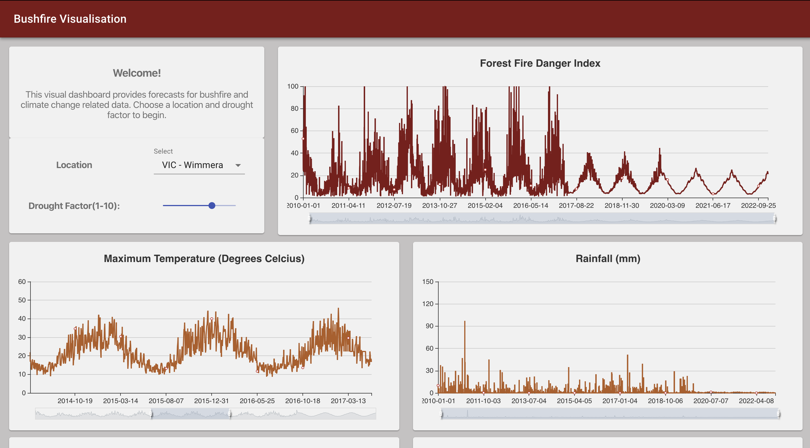

## Australian Bushfires Visualisation Project
#### This project was created by Aditi Venkatesh, Zaccary Allan and Jessica Oh Hui Yu.

With more Australian's moving to the outer suburbs and the increasing threats of bushfires in these areas, it is more important than ever that residents are aware of future risk of fire.

Data collected from Kaggle and the Bureau of Meteorology was cleaned and used to forecast future climate conditions. This data was then used in conjunction with McArthur's Forest Fire Index to predict Bushfire risk.

<strong> Note: This is a proof of concept. The predictions generated are not completely accurate and it is not recommended to take action on the basis of the data displayed in this dashboard. </strong>
